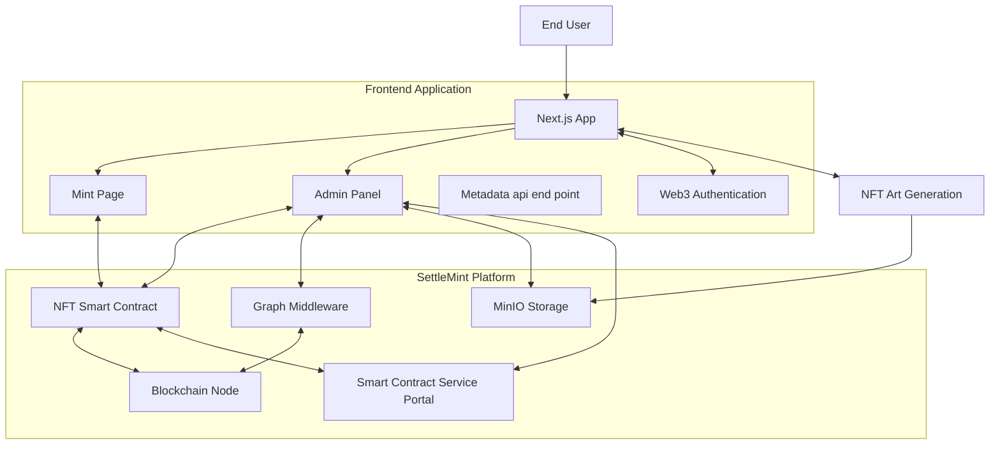

# NFT Dog App - Developer's Guide

This guide provides a comprehensive overview of the NFT Dog App built on the SettleMint platform. The application allows users to mint, view, and manage dog-themed NFTs on a private blockchain.

## System Architecture



## 1. Deploying a Blockchain Network

Instead of using CLI commands, you'll deploy your blockchain network through the SettleMint Platform UI:

1. Log in to your SettleMint account
2. Navigate to the "Blockchain Networks" section
3. Click "Create Network" and select "Besu" as the blockchain type
4. Follow the prompts to configure and deploy your network

After deployment, you'll need to copy your RPC URL and Chain ID from the network details page for your environment configuration.

## 2. Deploying the Smart Contract

### Contract Overview

The NFT Dog App uses an ERC-721 contract for managing NFT minting and transfers.

Key features:
- Token minting functionality
- Reserve collection (for team NFTs)
- Public sale management
- Pause/unpause capabilities
- Base URI management for metadata

### Modifying the Contract Price

Before deployment, update the contract price to 0 for easier testing:

```solidity
// In contracts/NFTDogCollection.sol
uint256 public constant PRICE = 0; // Change from original price to 0
```

### Deploy the Contract

Deploy your smart contract to the Besu network:

```bash
# Deploy the contract to your blockchain node
bunx settlemint scs hardhat deploy remote
```

After deployment, take note of the contract address from the deployment output. You'll need it for your environment configuration.

## 3. Deploying Graph Middleware (GMW)

The Graph Middleware indexes blockchain events to enable efficient querying of NFT transfers and other data:

```bash
# Generate TypeScript types based on your GraphQL schema
bunx settlemint scs subgraph codegen

# Build the subgraph
bunx settlemint scs subgraph build

# Deploy the subgraph
bunx settlemint scs subgraph deploy
```

After deployment, copy the GraphQL endpoint URL from the deployment output for your environment configuration.

## 4. Deploying MinIO Storage

For MinIO storage, use the SettleMint Platform UI:

1. Navigate to the "Storage" section
2. Create a new storage instance
3. Create buckets named "nft-collection" with "metadata" and "images" folders

After creation, copy the S3 endpoint, access key, secret key, and bucket name from the storage details page.

## 5. Setting Up Environment Variables

Create a `.env.local` file in your project root with the following variables. Here's where to find each value:

```
# Web3Auth Configuration
# Get your client ID from https://dashboard.web3auth.io
NEXT_PUBLIC_WEB3AUTH_CLIENT_ID=your_web3auth_client_id

# Chain Configuration 
# From the SettleMint Blockchain Network details page
NEXT_PUBLIC_RPC_URL=https://node-01-be1a1.gke-japan.settlemint.com/sm_aat_570ed8f08fdd3064
NEXT_PUBLIC_CHAIN_ID=49176

# Contract Configuration
# Contract address from your deployment output
NEXT_PUBLIC_CONTRACT_ADDRESS=0xBF12bBe3eFe81dc57104E4c1E1CBA36832F0f25d
# Admin wallet from SettleMint Private Keys section
NEXT_PUBLIC_ADMIN_WALLET_ADDRESS=0x665Fe3B8e7fe16fcE541D7122Ea3963bC3EE40c4

# Settlemint API Token
# From the SettleMint Application Access Tokens page
NEXT_PUBLIC_SETTLEMINT_TOKEN=SM-TOKEN

# S3 Configuration
# All from the SettleMint Storage details page
S3_ENDPOINT=api-s3-myURL.com
S3_API_PORT=443
S3_ACCESS_KEY=s3-access-key
S3_SECRET_KEY=s3-secert-key
S3_BUCKET_NAME=nft-collection

# Add public versions for frontend access
NEXT_PUBLIC_S3_ENDPOINT=api-s3-myURL.com
NEXT_PUBLIC_S3_BUCKET_NAME=nft-collection
```

### Environment Variable Sources:

1. **Web3Auth Client ID**:
   - Sign up at https://dashboard.web3auth.io
   - Create a new project and copy the Client ID

2. **Blockchain Network Information**:
   - **RPC URL**: From the SettleMint Platform "Blockchain Networks" section, select your network and copy the RPC URL
   - **Chain ID**: From the same page, copy the Chain ID

3. **Contract Information**:
   - **Contract Address**: From your contract deployment output or from the SettleMint Platform "Smart Contracts" section
   - **Admin Wallet Address**: From the SettleMint Platform "Private Keys" section

4. **SettleMint API Token**:
   - From the SettleMint Platform "Application Access Tokens" section
   - Create a new token if needed

5. **S3/MinIO Configuration**:
   - All values from the SettleMint Platform "Storage" section, select your storage instance
   - Duplicate the S3 endpoint and bucket name as public versions for frontend access

## 6. Running Initial Setup

After deploying your smart contract and configuring your environment, follow these steps:

## 7. Initial NFT Minting (Will Fail)

When users first attempt to mint an NFT, they will encounter failures because:

1. The reserved tokens need to be collected first
2. The public sale needs to be activated

This is by design to ensure proper setup before public minting.

## 8. Admin Panel Setup

Navigate to the `/admin` route in your application to access the admin panel:

### Step 1: Collect Reserves

Click the "Collect Reserves" button to mint the first batch of NFTs reserved for the team/project.

### Step 2: Start Public Sale

After reserves are collected, click the "Start Public Sale" button to enable public minting.

## 9. Successfully Minting NFTs

After completing the admin setup:

1. Navigate to the main page
2. Connect your wallet
3. Click the "Mint NFT" button
4. Confirm the transaction

The minting should now succeed, and you'll receive your NFT.

## 10. Viewing Transfers in Admin Panel

The admin panel includes a comprehensive transfer history section that:

1. Fetches all NFT transfers using GraphQL
2. Displays metadata for each NFT
3. Shows transaction details with links to the blockchain explorer
4. Provides debugging tools for checking metadata and images

## 11. Graph Middleware Integration

The Graph Middleware indexes blockchain events to enable efficient querying:

```javascript
// GraphQL query example from admin/page.tsx
const graphqlQuery = {
  query: `
    query MyQuery {
      erc721Transfers(orderBy: timestamp, orderDirection: desc, first: 100) {
        id
        from {
          id
        }
        timestamp
        to {
          id
        }
        token {
          identifier
          uri
        }
        transaction {
          id
          timestamp
        }
      }
    }
  `
};

// Fetch from GraphQL endpoint
const response = await fetch(
  graphqlApiUrl,
  {
    method: 'POST',
    headers: {
      'Content-Type': 'application/json',
      'x-auth-token': authToken
    },
    body: JSON.stringify(graphqlQuery)
  }
);
```

This provides real-time data about all NFT transfers without requiring direct blockchain queries.

## 12. Smart Contract Service (SCS) Portal Connection

The application interacts with the smart contract through SettleMint's API:

```javascript
// Example from admin/page.tsx
const response = await fetch(`${settlemintApiUrl}/erc-721/${contractAddress}/start-public-sale`, {
  method: 'POST',
  headers: {
    'Content-Type': 'application/json',
    'x-auth-token': authToken
  },
  body: JSON.stringify({
    from: adminWalletAddress,
    gasLimit: '',
    gasPrice: '',
    simulate: true,
    metadata: {}
  })
});
```

This approach:
- Simplifies blockchain interactions
- Handles gas estimation
- Manages transaction signing
- Provides consistent error handling

## 13. Web3 Authentication Integration

The app uses Web3 authentication to:

1. Connect user wallets
2. Sign transactions
3. Verify ownership of NFTs
4. Enable secure contract interactions

This is implemented through wallet connection hooks that handle different wallet providers.

## 14. NFT Art Generation

The NFT artwork is generated through:

1. Base images stored in MinIO
2. Metadata JSON files that reference these images
3. API routes that proxy the image and metadata requests

The structure in MinIO is:
- `/metadata/` folder contains JSON files (1.json, 2.json, etc.)
- `/images/` folder contains image files (1.png, 2.png, etc.)

Each metadata file references its corresponding image, creating the complete NFT.

## Running the Application

```bash
# Install dependencies
npm install

# Run the development server
npm run dev

# Build for production
npm run build

# Start production server
npm start
```

Visit `http://localhost:3000` to access the application.

## Troubleshooting

### Common Issues:

1. **Authentication Failures**: Ensure your SettleMint token is valid and correctly set in `.env.local`

2. **MinIO Access Issues**: Verify S3 credentials and check CORS configuration for the MinIO bucket

3. **Smart Contract Interactions Failing**: Check that you have sufficient balance in your admin wallet for gas fees

4. **Metadata Not Loading**: Ensure the base URI is correctly set and metadata files are properly structured

### Debugging Tools:

The admin panel includes debugging tools for:
- Testing S3 connections
- Viewing S3 configuration
- Refreshing NFT data
- Directly viewing NFT images and metadata

## Conclusion

This NFT Dog App demonstrates a complete blockchain-based NFT solution using SettleMint's platform. From smart contract deployment to frontend integration, the system provides a comprehensive NFT management solution with administrative capabilities.
